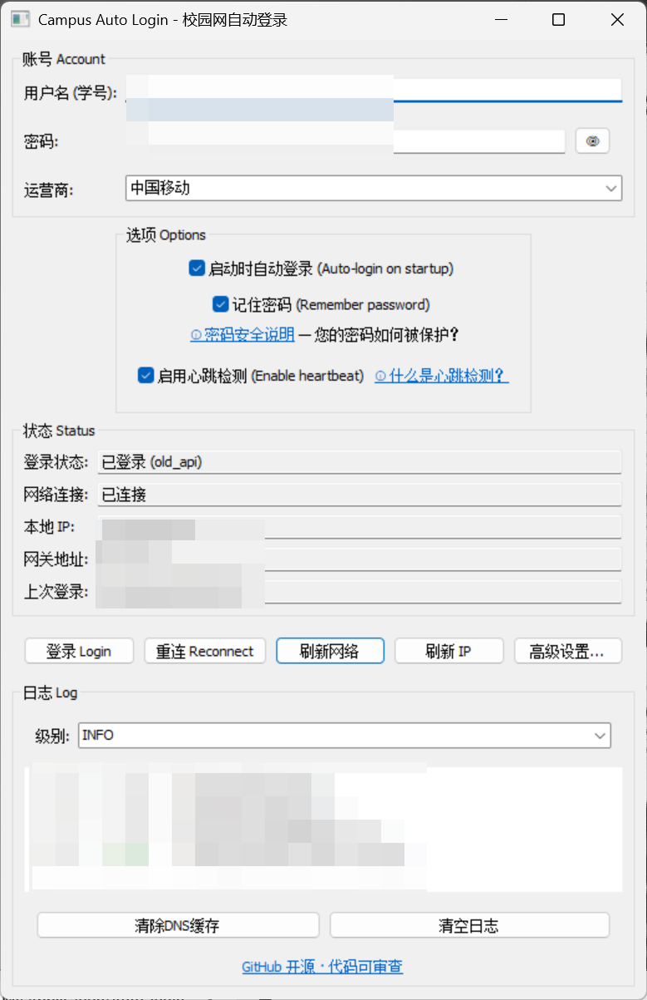
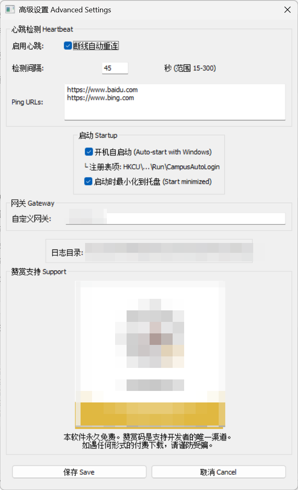

# CampusAutoLogin

[](https://go.dev)
[](https://www.microsoft.com/windows)
[](./LICENSE)

> Dr.COM 校园网自动登录工具 — 单文件 exe，无需安装任何运行时。

一个基于 **Go + walk** 的 Windows 系统托盘程序，支持有线/WiFi 双环境自动登录、心跳保活、断线重连。密码用 Windows DPAPI 加密存储，代码开源可审查。

---

## ✨ 功能

| 功能 | 说明 |
|------|------|
| 🔐 双引擎登录 | Portal v4.0 (WiFi, 801 端口) + 旧 API (有线, 80 端口)，支持移动/联通/电信/校园网 |
| 💓 心跳检测 | HTTP HEAD 定期探测，断线自动重连（指数退避） |
| 📡 系统托盘 | 最小化到托盘，三色图标（绿=正常 / 红=断开） |
| 🚀 开机自启 | 注册表 Run 键，`--silent` 静默启动不弹窗 |
| 🔒 密码安全 | Windows DPAPI 加密，仅本机本账户可解密 |
| 📝 彩色日志 | DEBUG/INFO/WARN/ERROR 四级颜色编码 |
| 🔔 通知弹窗 | 登录成功/失败/断线恢复，Windows 原生通知 |
| 🌐 DNS 预热 | 登录成功后自动刷新 DNS/ARP 缓存 |
| 📦 单文件分发 | 约 10MB exe，无需 .NET / Qt / 任何运行时 |

---

## 📸 截图





---

## 📥 下载

| 渠道 | 链接 | 提取码 |
|------|------|--------|
| **GitHub Releases** | [Releases](../../releases) | — |
| **蓝奏云**（国内高速） | [kurisut1na.lanzouu.com/igrYK3smafrg](https://kurisut1na.lanzouu.com/igrYK3smafrg) | `4y41` |

下载 `CampusAutoLogin.exe`，放到任意目录，双击运行。

> **无需安装。** 不写系统目录，不装驱动，不需要管理员权限。

配置文件和数据存储在：
```
%LOCALAPPDATA%\CampusAutoLogin\
  ├── config.json       # 配置（密码加密）
  └── logs\             # 运行日志（按天归档）
```

---

## 🚀 快速开始

1. 输入**学号**和**校园网密码**
2. 选择运营商（中国移动 / 联通 / 电信 / 校园网）
3. 点击 **登录 Login**
4. 勾选「启动时自动登录」+「记住密码」→ 下次启动自动完成认证

> 关闭窗口会最小化到系统托盘（**不会退出**）。右键托盘图标可显示/隐藏窗口、重连、打开日志目录、退出。

---

## 🖥️ 界面结构

```
┌── 账号 Account ────────────────────────┐
│  用户名 (学号)                          │
│  密码 (可切换显示/隐藏)                 │
│  运营商 (移动/联通/电信/校园网)          │
├── 选项 Options ────────────────────────┤
│  ☑ 启动时自动登录                      │
│  ☑ 记住密码     密码安全说明           │
│  ☑ 启用心跳检测                        │
├── 状态 Status ─────────────────────────┤
│  登录状态 / 网络连接 / IP / 网关       │
├── 操作 ────────────────────────────────┤
│  [登录] [重连] [刷新网络] [高级设置]   │
├── 日志 Log ────────────────────────────┤
│  彩色日志面板 (DEBUG/INFO/WARN/ERROR)  │
│  支持级别过滤 / 清空                   │
└────────────────────────────────────────┘
```

---

## ⚙️ 高级设置

| 设置 | 说明 | 默认值 |
|------|------|--------|
| 心跳检测 | 定期探测网络连通性 | 开启 |
| 检测间隔 | 两次探测之间的秒数 | 45s (15–300) |
| Ping URLs | 检测目标网址（每行一个） | baidu.com, bing.com |
| 自定义网关 | 手动指定 Dr.COM 网关 IP | 自动探测 |
| 开机自启动 | 写入注册表 Run 键 | 关闭 |
| 启动最小化 | 开机时静默驻留托盘 | 关闭 |

---

## 🔒 密码安全

密码使用 **Windows DPAPI**（`CryptProtectData`）加密后存储：

```
明文密码 → DPAPI 加密 → Base64 编码 → config.json
```

| 场景 | 能否解密 |
|------|----------|
| 同一台电脑，同一 Windows 用户 | ✅ 正常使用 |
| 拷贝 config.json 到另一台电脑 | ❌ 绑定原机器 |
| 同一台电脑，不同 Windows 用户 | ❌ 绑定原用户 |
| 重装系统 | ❌ 用户 SID 变更 |
| 管理员读取配置文件 | ❌ 只能看到 Base64 密文 |

- **无外部密钥文件** — 加密密钥由 Windows 内核从你的登录凭据派生
- **密码明文仅在登录时短暂存在于内存中**（几秒），不持久化到磁盘
- **代码开源** — 所有加密逻辑在 `config.go` 中，可自行审查

---

## ❓ 常见问题

**Q: 校园网和运营商有什么区别？**
A: 三大运营商（移动/联通/电信）在用户名后附加 `@cmcc` 等后缀进行认证，校园网则直接使用学号登录，并附加 IPv6 地址参数。如果你学校不使用运营商通道，选择「校园网」即可。

**Q: 登录成功但无法上网？**
A: WiFi 环境下旧 API 可能返回成功但实际不通。软件已内置 Portal v4.0 双引擎自动切换。

**Q: 心跳检测耗流量、影响网速吗？**
A: 不会。每次发送 HTTP HEAD 请求（仅获取响应头，不下载内容），请求体 < 1KB。45 秒间隔下全天流量约 2MB，CPU 占用可忽略。

**Q: 登录后过几十秒才能上网？**
A: 正常。程序在登录后自动执行 DNS 刷新和网络预热，这是校园网路由收敛的过程，与程序无关。

**Q: 为什么任务管理器启动项里看不到？**
A: 在高级设置中勾选"开机自启动"并保存后，可手动验证：
```cmd
reg query HKCU\Software\Microsoft\Windows\CurrentVersion\Run /v CampusAutoLogin
```

**Q: 如何彻底退出？**
A: 右键系统托盘图标 → 退出。关闭窗口只是最小化到托盘。

**Q: 如何完全清除数据？**
A: 删除 `%LOCALAPPDATA%\CampusAutoLogin\` 整个目录。

---

## 🔧 从源码构建

```bash
# 前提：Go 1.21+、MinGW-w64 (walk 需要 CGO)

git clone https://github.com/Kurisut111na/CampusAutoLogin.git
cd CampusAutoLogin

# 发布构建（无控制台窗口、去除调试符号）
go build -ldflags="-s -w -H windowsgui" -o CampusAutoLogin.exe .

# 开发构建（保留控制台输出，方便调试）
go build -o CampusAutoLogin.exe .
```

---

## ⚠️ 声明

- **本软件永久免费。** 赞赏码是支持开发者的**唯一渠道**。
- 如遇任何形式的**付费下载、付费代装、付费代配置**，请谨防受骗。
- 本软件仅用于合法的校园网自动登录，请勿用于未授权访问。
- 开发者不承担因使用本软件导致的网络问题或账户异常。

---

## 📄 开源协议

MIT © Kurisut111na

---

## 🙏 致谢

- [lxn/walk](https://github.com/lxn/walk) — Windows GUI 库
- [lxn/win](https://github.com/lxn/win) — Windows API 绑定
- Dr.COM 协议分析来自浏览器 F12 抓包
